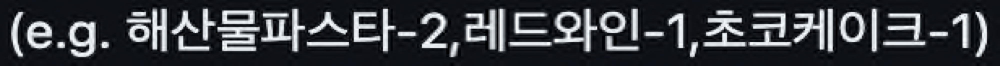

# 기능명세서

## 입력
- [x] 방문 날짜 입력받기
- [x] 메뉴와 개수 입력받기

## 출력
- [x] 주문메뉴 출력하기
- [x] 할인 전 총 주문금액 출력하기
- [x] 증정 메뉴 출력하기
- [x] 혜택 내역 출력하기
- [x] 총혜택 금액 출력하기
- [x] 할인 후 예상 금액 출력하기
- [x] 12월 이벤트 배지 출력하기

## 로직
- [x] 메뉴판의 메뉴들을 setUp 해두기
- [x] 사용자가 입력한 방문 날짜, 메뉴와 개수를 통해 유저 정보 객체 생성하기
  - [x] 주문 메뉴들의 메뉴타입(메인,디저트,,,) 를 저장하는 객체를 통해 각 타입에 대한 갯수 저장
- [x] 이벤트 적용 객체에서 사용자의 정보를 이용하여 할인 적용하기

# 예외 처리

## 공통 예외
- [x] 공백이 입력된 경우
  - ex) ""

## 날짜 입력
- [x] 날짜가 숫자가 아닌 문자가 입력된 경우
  - ex) a
- [x] 날짜가 1 ~ 31 외의 수가 들어온 경우
  - ex) 0, -1, 240

## 메뉴 및 개수 입력

- [x] 메뉴 형식이 위의 예시와 다른 경우
  - ex) 해산물파스타=3,초코케이크_2
- [x] 각 메뉴의 갯수가 숫자가 아닌 문자가 입력된 경우
  - ex) 해산물파스타-one,초코케이크-two
- [x] 각 메뉴의 갯수가 (1 ~ 20) 외의 수가 입력된 경우
  - ex) 해산물파스타-24,레드와인-25
- [x] 메뉴 갯수를 합쳤을때 20개 초과인 경우
  - ex) 해산물파스타-18,초코케이크-5
- [x] 메뉴판에 없는 메뉴를 입력한 경우
  - ex) 초코비-1,페퍼로니피자-2
- [x] 중복 메뉴를 입력한 경우
  - ex) 초코케이크-1,초코케이크-2
- [ ] 음료만 주문한 경우
  - ex) 제로콜라-1,레드와인-3